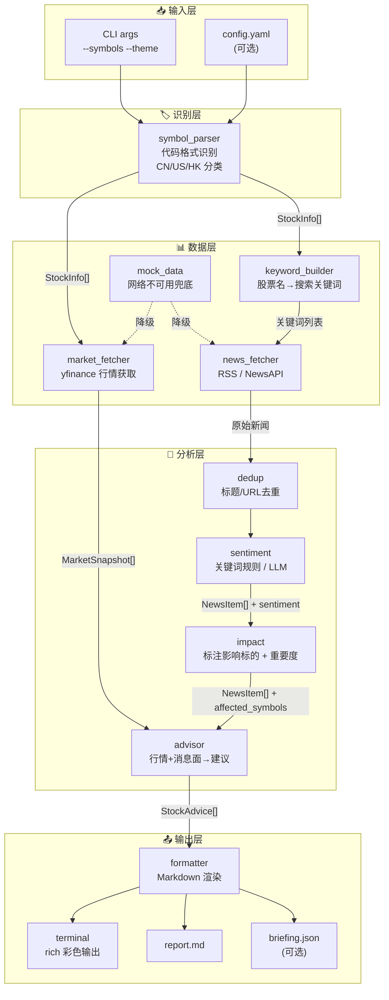

# PRD — 股票分析器：多市场消息面 + 操作建议工具

---

## 目录

1. [产品定位](#1-产品定位)
2. [用户画像与场景](#2-用户画像与场景)
3. [核心用户旅程](#3-核心用户旅程)
4. [功能需求](#4-功能需求)
5. [数据模型](#5-数据模型)
6. [架构设计](#6-架构设计)
7. [MVP 范围界定](#7-mvp-范围界定)
8. [分阶段路线图](#8-分阶段路线图)
9. [风险登记册](#9-风险登记册)
10. [成功标准](#10-成功标准)
11. [附录：参考资料](#11-附录参考资料)

---

## 1. 产品定位

### 一句话

> 给定**任意一组股票代码（A股 / 美股 / 港股）**，自动获取当日行情 + 相关新闻，生成**消息面摘要 + 操作建议**的每日简报。

### 核心能力

| 能力 | 说明 |
|------|------|
| **多市场行情** | 输入股票代码，自动识别市场（CN / US / HK），拉取当日行情 |
| **智能新闻匹配** | 根据股票名称、行业、成分股自动构造搜索关键词，抓取相关新闻 |
| **情感+影响分析** | 判断每条新闻的利好/利空方向，标注影响哪些持仓标的 |
| **可操作建议** | 综合行情涨跌 + 消息面偏向，给出每只股票的操作建议 + 理由 |

### 题目示例场景

> *"我目前重点关注AI产业链发展，并购买了纳指科技ETF和中韩半导体ETF"*

这只是**一个使用场景**。系统本身不绑定AI产业链，也不绑定这两只ETF——用户可以输入任何股票代码。

```
# 示例1：题目场景
python main.py --symbols 513100 513310 --theme "AI产业链"

# 示例2：新能源投资者
python main.py --symbols TSLA 300750.SZ 01211.HK --theme "新能源"

# 示例3：不指定主题，自动从股票信息推断
python main.py --symbols AAPL 600519.SH 9988.HK
```

### 产品形态

- **V1**：命令行脚本 → 终端输出 + Markdown 文件
- **V2（加分）**：Streamlit Web 面板
- **V3（远期）**：定时任务 + 推送

### 不做的事

- 不做实时交易信号（不是量化交易系统）
- 不做回测（不是策略引擎）
- 不提供投资建议的法律效力（必须带免责声明）

### 与 reporter 项目的关系

| 维度 | reporter | stock_analyzer |
|------|----------|---------------|
| 输入 | profile + calendar + emails + news | **股票代码列表** + 行情数据 + 相关新闻 |
| 核心逻辑 | 硬过滤 → 打分 → Top-K → 去重 | **市场识别 → 行情获取 → 新闻匹配 → 情感 → 建议** |
| 输出 | briefing.txt + briefing.json | 每日简报（终端 + Markdown） |
| 架构模式 | **确定性多步流水线** | **同：确定性多步流水线** |
| LLM角色 | 可选润色（`--llm`） | 可选语义分析（`--llm`） |

---

## 2. 用户画像与场景

### 主用户画像：多市场个人投资者

| 属性 | 描述 |
|------|------|
| **身份** | 持有A股 + 美股 + 港股中多只股票的个人投资者 |
| **持仓特征** | 跨市场（如A股ETF + 美股个股 + 港股ETF），关注某个产业链/主题 |
| **信息习惯** | 每天开盘前或收盘后花5分钟看汇总，不想逐个市场翻新闻 |
| **决策风格** | 中长期持有为主，关注单日大波动是否需要调仓 |
| **痛点** | 跨市场信息分散、不知道哪条新闻真正影响自己的持仓、缺乏系统化的每日检查清单 |

### 使用场景（题目示例）

```
08:30  用户打开终端
       ↓
08:31  python main.py --symbols 513100 513310 --theme "AI产业链"
       ↓
       终端打印：
         📊 行情快照
         ┌──────────────────┬────────┬────────┐
         │ 标的              │ 市场   │ 涨跌幅  │
         ├──────────────────┼────────┼────────┤
         │ 纳指科技ETF       │ A股    │ -1.2%  │
         │ 中韩半导体ETF     │ A股    │ -0.8%  │
         └──────────────────┴────────┴────────┘

         📰 关键消息 (AI产业链)
         1. [利好 纳指科技] NVIDIA 发布新一代 AI 芯片 B200
         2. [利空 中韩半导体] 韩国拟扩大对华芯片设备出口审查
         3. [利好 双标的] AI 服务器订单超预期，台积电追加产能
         ...

         💡 操作建议
         ┌──────────────────┬────────┬──────────────────────┐
         │ 标的              │ 建议   │ 理由                  │
         ├──────────────────┼────────┼──────────────────────┤
         │ 纳指科技ETF       │ 持有   │ NVIDIA新品利好支撑；   │
         │                  │        │ 跌幅不大无需操作       │
         │ 中韩半导体ETF     │ 关注   │ 出口管制风险升温；     │
         │                  │        │ 等待进一步明朗          │
         └──────────────────┴────────┴──────────────────────┘
       ↓
08:35  用户看完，做出今日操作决定
```

---

## 3. 核心用户旅程

### 主流程

```
┌──────────────┐   ┌──────────────┐   ┌──────────────┐   ┌──────────────┐   ┌──────────────┐
│  输入         │──▶│  识别 + 获取  │──▶│  分析         │──▶│  生成         │──▶│  输出         │
│ 股票代码列表  │   │ 市场/行情/新闻│   │ 情感/影响/建议│   │ 简报内容     │   │ 终端 + 文件  │
└──────────────┘   └──────────────┘   └──────────────┘   └──────────────┘   └──────────────┘
                          │                   │                   │
                          ▼                   ▼                   ▼
                   ┌─────────────┐    ┌─────────────┐    ┌─────────────┐
                   │市场识别      │    │规则引擎      │    │rich 终端渲染│
                   │CN/US/HK      │    │+ 二维矩阵    │    │+ Markdown   │
                   │yfinance      │    │(+ LLM可选)   │    │+ JSON(可选)  │
                   │+ 新闻搜索    │    │              │    │             │
                   └─────────────┘    └─────────────┘    └─────────────┘
```

### 详细步骤

| 步骤 | 用户动作 | 系统行为 | 输出 |
|------|---------|---------|------|
| 1 | `python main.py --symbols <代码列表> [--theme 主题]` | 解析代码列表，识别每个代码的市场 | 市场分类结果 |
| 2 | - | **并行**获取所有股票的行情（yfinance） + 搜索相关新闻（RSS / NewsAPI） | 原始行情 + 新闻列表 |
| 3 | - | 新闻去重 → 情感打分 → 标注影响哪些持仓标的 | 带标签的新闻列表 |
| 4 | - | 单只股票：综合行情涨跌 + 相关新闻情感 → 套用决策矩阵 | 每只股票一条建议 |
| 5 | - | 组装报告模板 → 渲染 | 终端彩色输出 + report.md |
| 6 | 阅读简报 | - | - |

### 异常流程

| 场景 | 处理方式 |
|------|---------|
| 某代码查询失败（退市/错误代码） | `⚠️ 000000.SZ 行情获取失败：未找到该代码`，跳过该标的继续处理其他 |
| 全部行情获取失败（网络问题） | 自动降级到 mock 数据，报告顶部署顶显示 `⚠️ 数据源不可用，以下为模拟数据` |
| 当日无相关新闻 | 该标的显示 `📰 暂无重大相关消息`，建议仅基于行情生成 |
| 用户输入了不支持的市场的代码 | 报错提示支持的市场：A股 / 美股 / 港股 |
| 部分市场收盘、部分盘中 | 每只标的标注数据时间（如 `北京时间 15:00`、`美东时间 09:35 盘中`） |

---

## 4. 功能需求

### FR1：输入解析与市场识别

| ID | 需求 | 优先级 |
|----|------|--------|
| FR1.0 | **接收任意数量的股票代码作为输入**（CLI参数或配置文件） | P0 |
| FR1.1 | 自动识别代码所属市场：A股（600xxx.SH / 000xxx.SZ）/ 美股（AAPL）/ 港股（0700.HK） | P0 |
| FR1.2 | 支持多种代码格式：纯数字（A股）、字母（美股）、混合格式，自动补全后缀 | P0 |
| FR1.3 | 支持 `--theme` 参数指定关注主题（用于新闻搜索关键词补充） | P0 |
| FR1.4 | 支持 `--config` 指向配置文件（替代命令行传参，方便反复使用） | P1 |

### FR2：行情数据获取

| ID | 需求 | 优先级 |
|----|------|--------|
| FR2.1 | 获取所有输入股票的当日行情（最新价、涨跌幅、成交量、日期时间） | P0 |
| FR2.2 | 标注每只股票的数据时区和更新时间（盘中/已收盘） | P0 |
| FR2.3 | 自动将不同市场的股票代码转换为 yfinance 标准格式 | P0 |
| FR2.4 | 某只股票获取失败不影响其他股票的获取 | P0 |
| FR2.5 | 获取关联指数作为背景参考（如上证指数、恒生指数、纳斯达克100） | P2 |

### FR3：新闻获取与匹配

| ID | 需求 | 优先级 |
|----|------|--------|
| FR3.1 | 根据股票名称 + theme 自动构造搜索关键词，获取相关新闻 | P0 |
| FR3.2 | 新闻去重（同标题/同URL） | P0 |
| FR3.3 | 新闻按与持仓的相关性排序（直接提及股票名 > 提及行业/成分股 > 提及主题） | P0 |
| FR3.4 | 每只股票至少尝试匹配N条相关新闻（默认3-5条） | P1 |
| FR3.5 | 支持多数据源交叉验证（RSS + NewsAPI 等） | P2 |
| FR3.6 | 支持自定义RSS源 | P2 |

### FR4：情感与影响分析

| ID | 需求 | 优先级 |
|----|------|--------|
| FR4.1 | 基于中英文关键词规则判断单条新闻的利好/利空/中性 | P0 |
| FR4.2 | 标注每条新闻影响的持仓标的（可能影响多只） | P0 |
| FR4.3 | 汇总每只标的的当日消息面倾向（偏多/偏空/中性） | P0 |
| FR4.4 | 处理否定句式避免误判（"下跌空间有限" ≠ 利空） | P1 |
| FR4.5 | LLM驱动的语义级分析（需 `--llm` 参数） | P1 |

### FR5：操作建议生成

| ID | 需求 | 优先级 |
|----|------|--------|
| FR5.1 | 综合单只股票的行情涨跌 + 相关消息面，生成一条操作建议 | P0 |
| FR5.2 | 建议类型：关注 / 持有 / 加仓 / 减仓 | P0 |
| FR5.3 | 每条建议附带1-2句理由（可追溯到具体新闻或行情数据） | P0 |
| FR5.4 | 可配置的涨跌幅阈值 | P1 |

### FR6：报告输出

| ID | 需求 | 优先级 |
|----|------|--------|
| FR6.1 | 终端彩色输出，四大板块清晰分隔（行情→消息→评估→建议） | P0 |
| FR6.2 | 同步输出 report.md 文件 | P0 |
| FR6.3 | 报告顶部包含日期和免责声明 | P0 |
| FR6.4 | JSON结构化输出（`--output json`） | P1 |
| FR6.5 | 支持 `--output-dir` 指定输出目录 | P1 |

---

## 5. 数据模型

### 5.1 输入

用户通过 CLI 或配置文件提供股票代码列表。

```bash
# CLI 方式
python main.py --symbols 513100 513310 AAPL 0700.HK --theme "AI产业链"

# 配置文件方式 (config.yaml)
python main.py --config portfolio.yaml
```

```yaml
# portfolio.yaml — 持仓配置文件（可选，不指定则纯CLI传参）
stocks:
  - symbol: "513100"        # 支持 600519.SH / AAPL / 0700.HK 等格式
    name: "纳指科技ETF"      # 可选，不填则自动从行情数据获取
  - symbol: "513310"
  - symbol: "AAPL"
  - symbol: "0700.HK"

theme: "AI产业链"             # 可选，关注主题（用于新闻搜索关键词补充）

analysis:                     # 分析参数（有默认值）
  price_change_thresholds:
    big_up: 3.0
    big_down: -3.0
    attention: 1.5
```

### 5.2 市场识别规则

```python
# 输入代码 → yfinance 标准格式 → 市场
MAPPING = {
    # A股：纯数字6位 → 补后缀
    "513100": ("513100.SS", "CN"),   # 上交所ETF → .SS (实际yfinance用.SS)
    "600519": ("600519.SS", "CN"),   # 上交所
    "000001": ("000001.SZ", "CN"),   # 深交所
    "300750": ("300750.SZ", "CN"),   # 创业板

    # 美股：字母 → 原样
    "AAPL":   ("AAPL",      "US"),
    "TSLA":   ("TSLA",      "US"),
    "NVDA":   ("NVDA",      "US"),

    # 港股：5位数字 → .HK
    "00700":  ("0700.HK",   "HK"),   # 腾讯
    "09988":  ("9988.HK",   "HK"),   # 阿里巴巴

    # 已带后缀的 → 保留原格式
    "0700.HK": ("0700.HK",  "HK"),
    "600519.SH": ("600519.SS", "CN"),
    "300750.SZ": ("300750.SZ", "CN"),
}
```

### 5.3 核心数据结构

```python
@dataclass
class StockInfo:
    """单只股票的基础信息"""
    input_symbol: str          # 用户输入的原始代码
    normalized_symbol: str     # yfinance 标准格式 (513100.SS)
    market: str                # "CN" | "US" | "HK"
    name: str                  # 从行情数据获取的名称
    sector: str | None         # 行业分类（如有）
    components: list[str]      # 主要成分股（ETF时需要）


@dataclass
class MarketSnapshot:
    """单只股票的行情快照"""
    symbol: str
    name: str
    market: str
    price: float
    change_pct: float          # 涨跌幅 %
    change_amount: float       # 涨跌额
    volume: int
    prev_close: float
    data_time: datetime        # 行情数据时间
    market_status: str         # "盘中" | "已收盘" | "盘前" | "盘后"
    timezone: str              # "Asia/Shanghai" | "America/New_York"


@dataclass
class NewsItem:
    """处理后的新闻条目"""
    id: str
    title: str
    summary: str               # 摘要（截断到120字）
    source: str
    url: str
    published: datetime
    sentiment: str             # "positive" | "negative" | "neutral"
    affected_symbols: list[str]  # 影响的股票代码（normalized）
    relevance_score: float     # 0.0-1.0，与该标的的相关度
    importance: str            # "high" | "medium" | "low"


@dataclass
class StockAdvice:
    """单只股票的操作建议"""
    symbol: str
    name: str
    action: str                # "hold" | "watch" | "accumulate" | "reduce"
    confidence: str            # "high" | "medium" | "low"
    reasons: list[str]         # 1-2条理由
    risk_note: str | None


@dataclass
class DailyBriefing:
    """每日简报"""
    date: str
    disclaimer: str
    snapshots: list[MarketSnapshot]                     # 所有股票的行情
    news_by_symbol: dict[str, list[NewsItem]]           # symbol → 相关新闻
    news_sentiment_summary: dict[str, dict[str, int]]   # symbol → {"positive":N, ...}
    advice: list[StockAdvice]                           # 每只股票一条建议
    dropped_news: list[dict]                            # 被丢弃的新闻 + 原因
    data_status: str                                    # "live" | "mock" | "partial"
```

### 5.4 输出示例（report.md）

```markdown
# 📊 每日投资简报

**日期**: 2026-06-21 (周一)
**数据状态**: ✅ 实时数据
**免责声明**: ⚠️ 本报告由AI生成，仅供参考，不构成投资建议。投资有风险，决策需谨慎。

---

## 📈 行情快照

| 标的 | 市场 | 最新价 | 涨跌幅 | 成交量 | 状态 |
|------|------|--------|--------|--------|------|
| 纳指科技ETF (513100) | A股 | 1.856 | -1.20% | 1.2亿 | 已收盘 |
| 中韩半导体ETF (513310) | A股 | 1.234 | -0.80% | 0.8亿 | 已收盘 |

---

## 📰 关键消息

### 纳指科技ETF (513100)

| # | 情感 | 标题 | 来源 |
|---|------|------|------|
| 1 | 🟢 利好 | NVIDIA发布新一代AI芯片B200，性能提升4倍 | Reuters |
| 2 | 🟢 利好 | 微软宣布追加500亿美元AI基础设施投资 | Bloomberg |
| 3 | 🟡 中性 | 纳斯达克100指数窄幅震荡，市场等待联储会议 | WSJ |

> 📊 消息面倾向：**偏多** (2利好 / 1中性 / 0利空)

### 中韩半导体ETF (513310)

| # | 情感 | 标题 | 来源 |
|---|------|------|------|
| 1 | 🔴 利空 | 韩国拟扩大对华芯片设备出口审查范围 | Yonhap |
| 2 | 🟢 利好 | SK海力士HBM3E订单排至2027年 | Bloomberg |
| 3 | 🟡 中性 | 中芯国际Q2产能利用率小幅回升 | 财联社 |

> 📊 消息面倾向：**中性偏分歧** (1利好 / 1中性 / 1利空)

---

## 💡 操作建议

| 标的 | 建议 | 置信度 | 理由 |
|------|------|--------|------|
| 纳指科技ETF | **持有** | 高 | NVIDIA新品+微软投资构成基本面支撑；跌幅1.2%在正常波动范围内 |
| 中韩半导体ETF | **关注** | 中 | 韩国出口管制构成短期风险；但HBM需求强劲提供对冲。建议观察明日走势 |

---

## 📋 被过滤的新闻 (3条)

| 原因 | 新闻 |
|------|------|
| 与持仓无关 | 特斯拉Model Y在欧洲降价 |
| 重复(同URL) | NVIDIA发布新一代AI芯片B200 |

---

*Generated by Stock Analyzer v0.1.0 at 2026-06-21 08:32 CST*
```

---

## 6. 架构设计

### 6.1 架构原则

1. **代码驱动，非配置绑定** — 股票列表由CLI参数或配置文件传入，不在代码中硬编码
2. **确定性多步流水线 > 单步LLM** — 每一步可审计、可调试
3. **每条数据和新闻都有归宿** — 要么出现在报告中，要么记录丢弃原因
4. **先规则后智能** — MVP用规则引擎跑通，LLM作为可选增强（`--llm`）
5. **容错降级** — 单只股票失败不影响整体；全失败则切换到mock模式

### 6.2 架构图



### 6.3 关键设计决策

| 决策点 | 选择 | 理由 |
|--------|------|------|
| **代码输入方式** | CLI `--symbols` 参数（主）+ YAML配置文件（辅） | CLI最快上手；YAML方便反复使用 |
| **市场识别** | 自动基于代码格式推断 + 显式后缀支持 | 用户不需要手动声明市场 |
| **行情数据源** | yfinance（跨CN/US/HK） | 免费、一个库覆盖三个市场 |
| **新闻搜索关键词** | 股票名称 + 成分股 + theme 组合 | 保证新闻与持仓相关，不过度泛化 |
| **新闻数据源** | Google News RSS（主）+ 内置mock（备） | RSS无需API Key |
| **情感分析** | 关键词规则引擎（中英双语 + 否定处理） | 零延迟、可解释、零成本 |
| **建议逻辑** | 二维决策矩阵：行情×消息面 | 规则透明，每条建议可追溯到数据源 |
| **输出格式** | rich终端 + Markdown文件 | 即时可读 + 可留存 |
| **LLM集成方式** | `--llm` 只替代 sentiment + advisor | 保持pipeline结构，LLM只做语义理解 |

### 6.4 建议逻辑：二维决策矩阵

```
                  消息面 →
    行情↓         偏多(>0.3)   中性(±0.3)   偏空(<-0.3)
    ────────────────────────────────────────────────
    大涨(>+3%)    加仓(高)     持有          关注风险
    小涨(+1~3%)   持有          持有          关注
    震荡(±1%)     关注          持有          关注
    小跌(-1~-3%)  关注          持有          持有
    大跌(<-3%)    关注抄底      关注          减仓(高)
```

> 消息面倾向 = (利好数 - 利空数) / 总新闻数，范围 [-1, 1]

### 6.5 新闻搜索关键词构造策略

```python
def build_search_keywords(stock: StockInfo, theme: str | None) -> list[str]:
    """
    根据股票信息构造新闻搜索关键词。

    策略（按优先级）：
    1. 股票名称本身（如 "纳指科技ETF" / "NVIDIA"）
    2. 主要成分股名称（ETF时特别重要，如 "英伟达" "台积电"）
    3. 用户指定的 theme（如 "AI产业链"）
    4. 行业关键词（从 sector 字段推导）
    """
```

---

## 7. MVP 范围界定

### ✅ MVP v1.0 范围（目标：30分钟内完成编码）

```
┌──────────────────────────────────────────────────────────┐
│                    MVP v1.0 范围                           │
├──────────────────────────────────────────────────────────┤
│                                                            │
│  🏷️ 输入层（~3 min）                                       │
│  ─────────────────                                        │
│  ☑ CLI解析 --symbols 参数，支持多个代码                      │
│  ☑ 代码格式自动识别（纯数字→A股, 字母→美股, 数字.HK→港股）    │
│  ☑ --theme 可选参数                                        │
│                                                            │
│  📊 数据层（~10 min）                                       │
│  ─────────────────                                        │
│  ☑ yfinance 跨市场获取行情（A股/美股/港股）                   │
│  ☑ 基于股票名+theme构造Google News RSS搜索URL                │
│  ☑ 内置 mock 数据（3只股票 + 10条新闻）                      │
│  ☑ 单只股票失败不影响其他                                    │
│                                                            │
│  🧠 分析层（~8 min）                                        │
│  ─────────────────                                        │
│  ☑ 中英文关键词情感规则 + 否定句式处理                        │
│  ☑ 新闻→标的映射（包含关键词即标注影响该标的）                 │
│  ☑ 二维决策矩阵生成每只股票的操作建议                         │
│                                                            │
│  📤 输出层（~7 min）                                        │
│  ─────────────────                                        │
│  ☑ rich 终端彩色报告（4板块：行情/消息/评估/建议）            │
│  ☑ report.md 文件输出                                      │
│  ☑ 免责声明                                                │
│  ☑ 丢弃的新闻列表 + 原因                                    │
│                                                            │
│  ⚙️ 工程（~2 min）                                         │
│  ─────────────────                                        │
│  ☑ requirements.txt (yfinance, feedparser, rich, pyyaml)   │
│  ☑ README.md 使用说明                                      │
│                                                            │
├──────────────────────────────────────────────────────────┤
│                    MVP 不包含                               │
├──────────────────────────────────────────────────────────┤
│                                                            │
│  ✗ LLM集成（预留 --llm 参数但暂不实现）                       │
│  ✗ 持久化存储 / 数据库                                      │
│  ✗ Web界面 / Streamlit                                     │
│  ✗ 配置文件模式（--config），MVP只做CLI传参                   │
│  ✗ 技术指标计算（均线、RSI、MACD）                           │
│  ✗ 邮件/微信推送                                            │
│  ✗ 多数据源交叉验证                                         │
│  ✗ 关联指数背景行情                                         │
│                                                            │
└──────────────────────────────────────────────────────────┘
```

---

## 8. 分阶段路线图

### Phase 1 — MVP（本次面试交付，~30 min）

| 步骤 | 产出 | 估时 |
|------|------|------|
| 1.1 项目骨架 | 文件结构 + requirements.txt + README 框架 | 3 min |
| 1.2 代码解析 | `symbol_parser.py` — 输入解析 + 市场识别 + yfinance格式转换 | 5 min |
| 1.3 行情获取 | `data/fetcher.py` — yfinance + mock fallback | 5 min |
| 1.4 新闻获取 | `data/news_fetcher.py` — 关键词构造 + RSS + mock fallback | 5 min |
| 1.5 情感分析 | `analysis/sentiment.py` — 关键词规则引擎 | 4 min |
| 1.6 建议生成 | `analysis/advisor.py` — 二维决策矩阵 | 3 min |
| 1.7 报告输出 | `output/reporter.py` — rich终端 + Markdown | 4 min |
| 1.8 入口串联 | `main.py` — 编排 pipeline + CLI | 3 min |
| 1.9 演示准备 | 准备题目示例场景的演示（513100 513310 + AI产业链） | 3 min |

### Phase 2 — 加分项（时间够就做，或口头说明）

| 功能 | 说明 |
|------|------|
| `--llm` 模式 | LLM替代规则引擎做情感分析 |
| JSON输出 | `--output json` 生成结构化数据 |
| `--config` 模式 | 支持YAML配置文件定义持仓组合 |
| 否定句式处理 | "下跌空间有限"不会被判为利空 |
| 技术面指标 | 5日/20日均线 |

### Phase 3 — 远期（仅设计层面提及）

| 功能 | 说明 |
|------|------|
| Streamlit Web面板 | 可视化Dashboard |
| 定时任务 | cron / GitHub Actions |
| 推送通知 | 企业微信/钉钉 Webhook |
| 历史相似行情 | 向量检索历史相似走势 |

---

## 9. 风险登记册

| # | 风险 | 概率 | 影响 | 缓解措施 |
|---|------|------|------|----------|
| **R1** | **yfinance 对A股/港股代码的支持不稳定** — 部分代码查不到或延迟大 | 中 | 🔴 致命 | 内置 mock 数据覆盖三种市场；准备 akshare 作为A股备选；yfinance 不可用时至少有一个市场能演示 |
| **R2** | **Google News RSS 在国内不可访问** | 高 | 🟡 中等 | 准备 Bing News / 财联社 RSS 备选；内置10条mock新闻确保可演示 |
| **R3** | **关键词规则过于粗糙** — 误判情感方向 | 高 | 🟡 中等 | 至少处理否定前缀（"不会/难以/有限/unlikely/not"）；报告中标注"规则引擎分析，仅供参考" |
| **R4** | **跨市场时区混乱** — A股已收盘、美股还在盘中，用户困惑 | 中 | 🟢 低 | 每只标的标注数据时间和市场状态（"盘中"/"已收盘"），报告中显著展示 |
| **R5** | **字符串匹配新闻→标的映射不准** — "苹果发布新品"可能不包含"Apple" 但确实影响AAPL | 中 | 🟡 中等 | MVP用关键词子串匹配兜底；在报告中标注映射方式；后续接LLM做语义级映射 |
| **R6** | **过度设计导致无法交付** | 中 | 🔴 致命 | 严格按 MVP 范围推进；先纵向打通一只股票的全链路，再加第二只、第三只 |

---

## 10. 成功标准

### MVP 验收标准

| # | 标准 | 验证方式 |
|---|------|---------|
| S1 | `python main.py --symbols 513100 513310 --theme "AI产业链"` 在5秒内输出完整报告 | 计时执行 |
| S2 | 支持A股/美股/港股三种代码格式输入 | 分别测试 `600519` / `AAPL` / `0700.HK` |
| S3 | 报告包含4个必需板块（行情→消息→评估→建议） | 目视检查 |
| S4 | 无网络时自动降级到 mock 数据并明确提示 | 断网测试 |
| S5 | 单只股票查询失败不影响其他股票 | 输入一个错误代码 + 两个正确代码 |
| S6 | 每条操作建议有至少1条理由 | 目视检查 |
| S7 | 报告顶部有免责声明 | 目视检查 |
| S8 | 同时生成 report.md | 文件存在性检查 |

### 加分项评价维度

| 维度 | 评价标准 |
|------|---------|
| **代码质量** | 模块清晰、有 docstring、类型注解、命名规范 |
| **可扩展性** | 加新股/新市场只需改配置，不动核心逻辑 |
| **健壮性** | 任何异常不崩溃，优雅降级 |
| **可解释性** | 每条建议可追溯到具体新闻或行情数据 |
| **演示能力** | 清晰讲解架构决策和权衡；展示 mock 和 live 两种模式 |

---

## 11. 附录

### A. 股票代码格式速查

| 市场 | 用户输入示例 | yfinance 格式 | 识别规则 |
|------|-------------|--------------|---------|
| A股-上交所 | `600519` `513100` | `600519.SS` | 6位数字，60xxxx / 51xxxx 开头 |
| A股-深交所 | `000001` `300750` | `000001.SZ` `300750.SZ` | 6位数字，00xxxx / 30xxxx 开头 |
| 美股 | `AAPL` `NVDA` `TSLA` | `AAPL` `NVDA` `TSLA` | 纯字母，1-5个字符 |
| 港股 | `0700` `9988` | `0700.HK` `9988.HK` | 4-5位数字（非6位） |
| 已带后缀 | `0700.HK` `600519.SH` | `0700.HK` `600519.SS` | 含 `.` 分隔符，直接解析 |

### B. 中英双语情感词典

```python
POSITIVE_CN = ["突破", "利好", "增长", "合作", "发布", "量产", "订单",
                "上调", "超预期", "创新高", "获批", "补贴", "政策支持",
                "回购", "分红", "盈利", "扩张", "融资", "上市"]
NEGATIVE_CN = ["制裁", "限制", "禁令", "下跌", "暴跌", "亏损", "裁员",
                "调查", "诉讼", "罚款", "下调", "低于预期", "贸易战",
                "退市", "违约", "暴雷", "造假", "停产", "召回"]

POSITIVE_EN = ["breakthrough", "rally", "upgrade", "beat", "record high",
                "partnership", "launch", "approval", "buyback", "expansion"]
NEGATIVE_EN = ["sanction", "restriction", "ban", "plunge", "decline",
                "investigation", "lawsuit", "fine", "downgrade", "miss",
                "layoff", "recall", "probe", "penalty", "delist"]

NEGATION_CN = ["不会", "难以", "有限", "未必", "不可能", "不至于"]
NEGATION_EN = ["unlikely", "not", "won't", "limited", "no sign of"]
```

### C. 项目结构

```
stock_analyzer/
├── main.py                # CLI入口，编排pipeline
├── symbol_parser.py       # 代码格式识别 + 市场分类 + yfinance格式转换
├── mock_data.py           # Mock数据（无网络兜底，覆盖三种市场）
├── data/
│   ├── __init__.py
│   ├── fetcher.py         # 行情获取（yfinance，CN/US/HK）
│   └── news_fetcher.py    # 新闻获取（关键词构造 + RSS + fallback）
├── analysis/
│   ├── __init__.py
│   ├── sentiment.py       # 情感分析（关键词规则 + LLM接口预留）
│   └── advisor.py         # 操作建议生成（决策矩阵）
├── output/
│   ├── __init__.py
│   └── reporter.py        # 报告格式化（rich + Markdown）
├── requirements.txt       # yfinance, feedparser, rich, pyyaml
└── README.md              # 使用说明 + 架构说明
```

---

> **文档版本**: v2.0  
> **修订**: 2026-06-21 — 从"绑定两只ETF"改为"任意多市场股票代码输入"  
> **状态**: 待评审 → 确认后进入 MVP 开发
